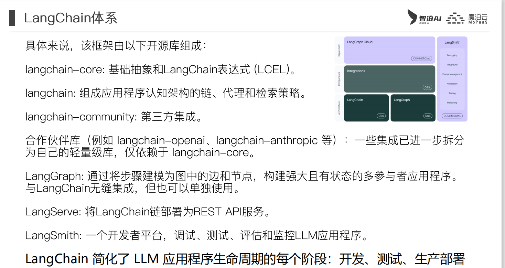

# 介绍
LangChain是一个用于开发由LLMs驱动的应用程序的框架。


## Model I/O

1. 提示词模板
2. 语言模型
3. 输出解析

## 提示词模板

- PromptTemplate
```python
template_str = "您是一位专业的程序员。\n对于信息 {text} 进行简短描述"
fact_text = "langchain"

# 第一种形式
prompt = PromptTemplate.from_template(template_str)

#第二种形式，有明显的约束，要求使用该模版时，必给变量 {text} 赋值
prompt2 =PromptTemplate(

    input_variables=["text"],

    template=template_str

)
print(prompt.format(text=fact_text))
```
- ChatPromptTemplate
```python
#聊天模版

#接收聊天消息/聊天消息列表

#消息分角色:系统消息，用户消息，助手消息(大模型的应答消息)

chat_template = ChatPromptTemplate.from_messages(

    [

        #用SystemMessagePromptTemplate来实现可以

        ('system',"请将以下的内容翻译成{language}"),

        HumanMessagePromptTemplate.from_template("{text}")

        #('human',"{text}"),

    ]

)

print(client.invoke(chat_template.format(language="英文", text="你好，今天的天真蓝")))

print(client.invoke(chat_template.format(language="法文", text="你好，今天的天真蓝")))
```
- FewShotPromptTemplate

-  提示模板部分格式化：适用于需要先给某些参数赋值，其余参数后期赋值。
```python

def get_datetime():
    import datetime
    return datetime.datetime.now().strftime("%Y-%m-%d %H:%M:%S")

# 配置一个提示模板
prompt_tmplt_txt = "讲一个关于{date}的{story_type}"

prompt = PromptTemplate(
    template=prompt_tmplt_txt,
    input_variables=["date", "story_type"]
)

half_p = prompt.partial(date=get_datetime())
#....其他业务代码
half_p.format(story_type="笑话")
half_p.format(story_type="悲伤的故事")
```

## 输出解析器（OutputParser）

- StrOutputParser
```python
# 原始输出
result = client.invoke(chat_template.format(language="英文", text="你好，今天的天真蓝"))

#字符串输出解析器
parser = StrOutputParser()

print(parser.invoke(result))
```

- DateOutputParser
- JsonOutputParser
使用Json输出解析器需要配合提示词进行，确保输出以Json格式返回
- XMLOutputParser

## Chain

```python
# prompt -> client -> parser
chain = chat_template | client | parser

# 传参需要是字典，key要和模版中的变量名一致

print(chain.invoke({"language":"法语", "text":"你好，今天的天真蓝"}))
```

**注意**：开启LangChain应用程序的调试功能

```python
#开启调试模型

langchain.debug = True
```
## LangServer

```python
#部署为服务

app = FastAPI(title="基于LangChain的大模型应用",version="V1.5",description="翻译服务")

add_routes(app, chain, path="/tslServer")

  

if __name__ == "__main__":

    import uvicorn

    uvicorn.run(app, host="localhost", port=8000)
    

'''比如在postman或者apifox中访问http://localhost:8000/tslServer/invoke

在body中选择json，然后输入

{

    "input":

    {

        "language":"意大利文",

        "text":"为了部落！"

    }

}'''
```
## LCEL

LangChain Expression language，用一种用声明式的方法来链接LangChain组件

- RunnableLambda()可以将自定义函数变成链中的一个组件，或者可以使用@chain在函数上标记注解
- RunnableParrallel / RunnableMap()
```python
def add_one(x: int) -> int:

    return x + 1

  

def mul_two(x: int) -> int:

    return x * 2

  

def mul_three(x: int) -> int:

    return x * 3

  

#组件化

runnable_1 = RunnableLambda(add_one)

runnable_2 = RunnableLambda(mul_two)

runnable_3 = RunnableLambda(mul_three)

  

#串行

chain_seq = runnable_1 | runnable_2 | runnable_3

print(chain_seq.invoke(1))

  

#并行

chain2 = runnable_1 | RunnableParallel(

    mul_two=runnable_2,

    mul_three=runnable_3) |  runnable_3

  

print(chain2.invoke(1))
```