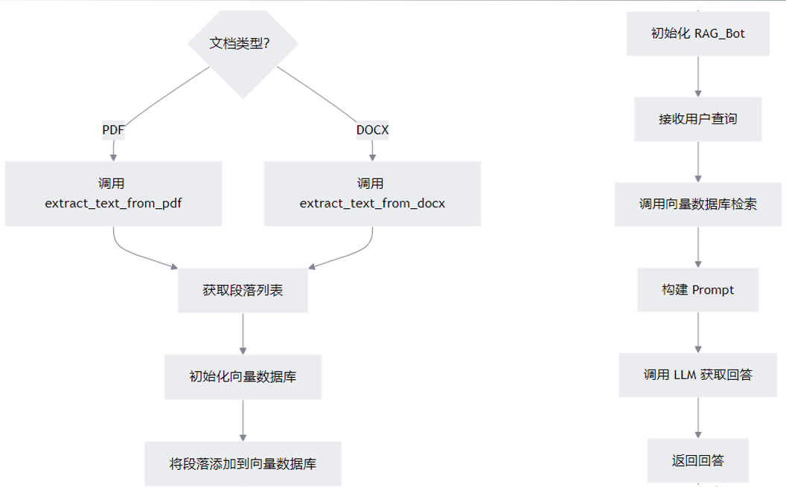
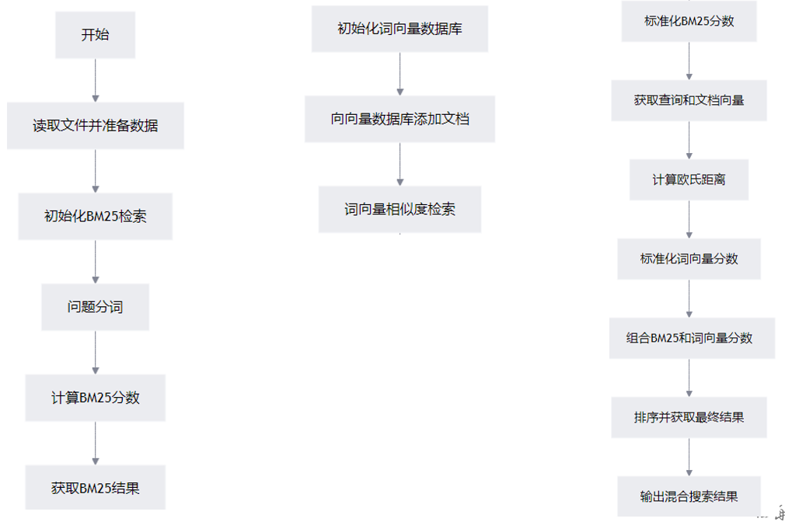

文档切分成chunk -> 文本向量化embedding -> 向量数据库
# 文档切分

1. 按照固定字符数切分
2. 按固定字符数，结合滑动窗口切分
3. 按照句子切分：根据。！？切分句子
4. 递归方法 RecursiveCharacterTextSplitter
	RecursiveCharacterTextSplitter 是一个用于将文本分割成较小块的工具。核心思想是根据一组分隔符（separators）逐步分割文本，直到每个块的大小都符合预设的chunk_size。如果某个块仍然过大，它会继续递归地分割，直到满足条件为止。其默认字符列表为 `["\n\n", "\n", " ", ""]`，这种设置首先尝试保持段落、句子和单词的完整性。

```python
def extract_text_from_docx(filename, min_line_length=1):

    """

    从 DOCX 文件中提取文字

  

    思路：

    1. 使用 python-docx 库读取文档

    2. 提取所有段落的原始文本

    3. 按空行分割并重组段落

    4. 过滤短行（假设为标题）

    5. 处理英文连字符情况

  

    参数：

    filename: DOCX文件路径

    min_line_length: 最小行长度，短于此长度的行将被视为段落分隔符

  

    返回：

    段落列表（每个元素为一个段落字符串）

    """

    paragraphs = []

    buffer = ''

    full_text = ''

  

    # 读取文档

    doc = Document(filename)

  

    # 提取原始文本（保留换行符）

    for para in doc.paragraphs:

        full_text += para.text + '\n'

  

    # 处理文本内容

    lines = full_text.split('\n')

    for line in lines:

        # 有效行处理（长度超过阈值）

        if len(line) >= min_line_length:

            # 处理连字符情况

            if not line.endswith('-'):

                buffer += ' ' + line

            else:

                buffer += line.strip('-')

        # 遇到分隔行时存储段落

        elif buffer:

            paragraphs.append(buffer.strip())

            buffer = ''

  

    # 处理最后一个段落

    if buffer:

        paragraphs.append(buffer.strip())

  

    return paragraphs
```

```python
def extract_text_from_pdf(filename, page_numbers=None, min_line_length=1):

    """

    从 PDF 文件中（按指定页码）提取文字

  

    思路：

    1. 使用 pdfplumber 逐页解析 PDF

    2. 根据指定页码过滤需要处理的页面

    3. 提取页面中的文本容器（LTTextContainer）内容

    4. 将所有文本按行暂存后，重新合并被换行的段落

    5. 处理英文单词的连字符情况

    6. 按空行分割段落

  

    参数：

    filename: PDF文件路径

    page_numbers: 指定要提取的页码列表（从0开始），None表示提取全部

    min_line_length: 最小行长度，短于此长度的行将被视为段落分隔符

  

    返回：

    段落列表（每个元素为一个段落字符串）

    """

    paragraphs = []

    buffer = ''  # 用于暂存正在构建的段落

    full_text = ''  # 存储提取的原始文本

  

    # 提取全部文本

    for i, page_layout in enumerate(extract_pages(filename)):  # 遍历每一页

        # 过滤页码：如果指定了页码范围且当前页不在范围内，则跳过

        if page_numbers is not None and i not in page_numbers:

            continue

  

        # 遍历页面中的每个元素

        for element in page_layout:

            # 仅处理文本容器（排除图片、表格等元素）

            # 这个判断的作用是：只处理纯文本内容，跳过图片/表格/图形等非文本元素

            if isinstance(element, LTTextContainer):

                full_text += element.get_text() + '\n'  # 保留换行用于后续处理

  

    # 按空行分隔，重新组织段落

    lines = full_text.split('\n')

    for text in lines:

        # 处理有效行（长度超过阈值）

        if len(text) >= min_line_length:

            # 处理连字符情况：行以连字符结尾时，拼接时不加空格并去除连字符

            if not text.endswith('-'):

                buffer += ' ' + text  # 普通行拼接

            else:

                buffer += text.strip('-')  # 处理被换行分割的单词

        # 遇到空行时，将暂存内容作为段落存入列表

        elif buffer:

            paragraphs.append(buffer.strip())  # 去除首尾空格后存储

            buffer = ''  # 重置暂存区

  

    # 处理最后一个段落

    if buffer:

        paragraphs.append(buffer.strip())

  

    return paragraphs
```
# 文本向量化

千问文本嵌入模型：text-embedding-v3
本地化部署：Ollama + bge-m3

# 向量相似度

1. 余弦距离 -- 越大越相似
2. 欧式距离 -- 越小越相似

# 向量数据库

主流数据库：Pinecone、Milvus、**Chroma**、Faiss
## Chroma

- 功能丰富：支持查询、过滤、密度估计等多种功能

- 很多开发框架如LangChain都支持

- 相同的API可以在Python笔记本中运行，也可以扩展到集群，用于开发、测试和生产闭源

- 轻量级、易用性，易于集成和使用，特别适合小型或中型项目‌

- 开源

将已有资料向量化存进向量知识库，然后将用户输入也向量化，使用向量相似度检索出对应内容
## 基于RAG实现公司HR制度智能问答系统


# 混合检索

- 关键字检索：

检索速度快，如果用户输入的关键字能够准确地代表所需信息，且文本中该关键字的使用具有明确的指向性，那么可以得到较为准确的结果。但如果关键字具有歧义，或者文本中存在大量与关键字相关但语义不同的内容，可能会导致检索结果不准确，出现误判或漏判的情况。

- 全文检索：

通常比关键字检索更准确，因为它考虑了文本的整体内容和上下文信息。能够理解用户查询语句的语义，更精确地匹配相关文档，减少因关键字歧义或片面匹配导致的错误。不过，对于一些复杂的语义理解和模糊查询，全文检索可能也存在一定的局限性。

- 基于词向量的相似度检索：

在语义理解和准确匹配方面具有较大优势。大模型能够学习到文本中的深层语义信息，在处理复杂的语义查询和模糊匹配时表现较好，能够返回更符合用户意图的检索结果。

## 全文检索

BM25

```python
# 从 rank_bm25 库中导入 BM25Okapi 类，用于计算 BM25 相似度得分
from rank_bm25 import BM25Okapi  #  pip install rank_bm25
# 导入 jieba 库，用于中文分词
import jieba

# 定义一个包含多个文档的语料库，每个文档是一个字符串
# ['这‘，’是‘，第一个，。。。]
corpus = [
    "这是第一个文档",
    "这是第二个文档",
    "这是第三个文档"
]

# 对语料库中的每个文档进行分词操作，使用 jieba.lcut() 函数将文档分割成词语列表
# 最终得到一个包含多个词语列表的列表，每个子列表对应一个文档的分词结果
#  进行分词处理。

tokenized_corpus = [jieba.lcut(doc) for doc in corpus]
print(tokenized_corpus)

# 使用分词后的语料库初始化 BM25Okapi 对象，后续将使用该对象进行相似度计算
bm25 = BM25Okapi(tokenized_corpus)

# 定义一个查询语句，即要查找相关文档的关键词
query = "第一个文档"

# 对查询语句进行分词操作，将其转换为词语列表
tokenized_query = jieba.lcut(query)

# 调用 BM25Okapi 对象的 get_scores 方法，计算查询语句与语料库中每个文档的相似度得分

# 得到一个包含多个得分的列表，每个得分对应语料库中的一个文档
scores = bm25.get_scores(tokenized_query)

# 打印计算得到的相似度得分列表
print(scores)  # 输出示例：[ 0.39285845 -0.11796717 -0.11796717]

# 调用 BM25Okapi 对象的 get_top_n 方法，根据查询语句的相似度得分从语料库中选取前 n 个最相关的文档

# 这里 n 设置为 1，表示只选取最相关的一个文档
top_n = bm25.get_top_n(tokenized_query, corpus, n=1)

# 打印选取的最相关文档列表
print(top_n)  # 输出：['这是第一个文档']
```

区别：全文检索基于关键词的统计匹配，侧重精确性和可解释性；大模型相似度基于语义向量的空间距离，侧重语义理解和泛化能力。

## 医疗知识混合检索实战

代码在assets中查看

## 混合检索相似度归一化

```python
# 4、组合BM25和词向量相似度检索的结果

#对全文检索和向量检索，都有相似度分数，基于分数进行融合？

#分数要进行标准化，学习L4也对数据标准化

  

#把python中的列表转为np所能支持的格式

bm25_score = np.array(bm25_scores)

#np.max找出其中最大的那个数，最大值做分母，得出的数一定小于1，所有的缩到了[0,1]，这叫归一化

bm25_scores_normalized = bm25_score / np.max(bm25_score)

  

# 获取查询的向量表示，并把结果转换为 NumPy 数组

query_embedding = np.array(get_embeddings_batch(query))

# 获取文档的向量表示，并把结果转换为 NumPy 数组

doc_embeddings = np.array(get_embeddings_batch(instructions))

# 计算查询向量和文档向量之间的欧氏距离

# np.linalg.norm 函数用于计算向量的范数，这里计算的是向量差的 L2 范数，即欧氏距离。axis=1 表示按行计算。

dense_scores = np.linalg.norm(query_embedding - doc_embeddings, axis=1)

#做归一化，1减去标准化的分数以后，得到相似度的分数

dense_scores_normalized = 1 - (dense_scores / np.max(dense_scores))

#分数的组合，引入一个权重的概念，目的根据业务的需求，决定文档的重要性，算出一个复合分数

combined_scores = 0.5 * bm25_scores_normalized + 0.5 * dense_scores_normalized

  

top_idx = combined_scores.argsort()[::-1]

print(top_idx)

hybrid_results = [outputs[i] for i in top_idx[:3]]

  

# 5. 输出混合搜索的结果

print("Hybrid Search Results: ", hybrid_results)
```

这段代码的核心目的是**混合检索（Hybrid Search）**，即结合“关键词匹配（BM25）”和“语义匹配（向量距离）”两种不同的评分机制。

由于BM25的分数范围通常是 $[0, +\infty)$，而欧氏距离的范围也是 $[0, +\infty)$，且两者的物理意义不同（BM25越大越好，欧氏距离越小越好），因此必须通过**归一化（Normalization）**将它们映射到同一个 $[0, 1]$ 区间，并统一方向（越大越好），才能进行加权求和。

以下是代码中涉及的数学公式的详细拆解：

---

### 1. BM25 分数的归一化

**代码对应：**
```python
bm25_scores_normalized = bm25_score / np.max(bm25_score)
```

**数学公式：**
假设对于查询 $Q$，检索回 $N$ 个文档，第 $i$ 个文档的原始 BM25 分数为 $S_{bm25}^{(i)}$。
令 $S_{max} = \max(S_{bm25}^{(1)}, S_{bm25}^{(2)}, ..., S_{bm25}^{(N)})$。

归一化后的分数 $Score_{BM25}^{(i)}$ 计算公式为：

$$
Score_{BM25}^{(i)} = \frac{S_{bm25}^{(i)}}{S_{max}}
$$

**原理解析：**
*   这是一种简化的**最大值归一化（Max-Normalization）**。
*   它将这组文档中得分最高的那个文档的分数变为 **1.0**。
*   其他文档的分数按比例缩放。
*   **范围：** $[0, 1]$（假设BM25分数为非负）。
*   **方向：** 分数越接近 1，表示相关性越高。

---

### 2. 向量检索分数的计算与归一化

这一步稍微复杂，包含了**距离计算**、**距离归一化**和**相似度转换**三个步骤。

#### A. 欧氏距离计算 (Euclidean Distance)
**代码对应：**
```python
dense_scores = np.linalg.norm(query_embedding - doc_embeddings, axis=1)
```

**数学公式：**
假设查询向量为 $\mathbf{q}$，第 $i$ 个文档的向量为 $\mathbf{d}_i$，向量维度为 $k$。
它们之间的欧氏距离 $D^{(i)}$ 为：

$$
D^{(i)} = \|\mathbf{q} - \mathbf{d}_i\|_2 = \sqrt{\sum_{j=1}^{k} (q_j - d_{ij})^2}
$$

**物理意义：** 值越**小**，表示两个向量在空间中越接近，语义越相似。

#### B. 距离归一化与相似度转换
**代码对应：**
```python
dense_scores_normalized = 1 - (dense_scores / np.max(dense_scores))
```

这里包含了两步数学运算：

**第一步：距离归一化**
令 $D_{max} = \max(D^{(1)}, D^{(2)}, ..., D^{(N)})$。
计算相对距离：
$$
D_{norm}^{(i)} = \frac{D^{(i)}}{D_{max}}
$$
此时，$D_{norm}^{(i)}$ 的范围是 $[0, 1]$，但依然是**越小越好**（0表示距离最近，1表示距离最远）。

**第二步：转换为相似度（反转）**
为了和 BM25（越大越好）结合，需要用 1 减去归一化的距离：

$$
Score_{Dense}^{(i)} = 1 - D_{norm}^{(i)} = 1 - \frac{D^{(i)}}{D_{max}}
$$

**原理解析：**
*   **范围：** $[0, 1]$。
*   **方向：**
    *   如果距离 $D^{(i)} = 0$（完全相同），则 $Score = 1 - 0 = 1$（最相关）。
    *   如果距离是所有文档里最大的 $D^{(i)} = D_{max}$，则 $Score = 1 - 1 = 0$（最不相关）。
*   通过这就把“距离”转化为了“相似度分数”。

---

### 3. 分数融合 (Weighted Fusion)

**代码对应：**
```python
combined_scores = 0.5 * bm25_scores_normalized + 0.5 * dense_scores_normalized
```

**数学公式：**
$$
Score_{Final}^{(i)} = \alpha \cdot Score_{BM25}^{(i)} + (1 - \alpha) \cdot Score_{Dense}^{(i)}
$$
在此代码中，权重因子 $\alpha = 0.5$。

即：
$$
Score_{Final}^{(i)} = 0.5 \cdot \left( \frac{S_{bm25}^{(i)}}{S_{max}} \right) + 0.5 \cdot \left( 1 - \frac{D^{(i)}}{D_{max}} \right)
$$

### 总结

这段代码通过以下数学变换完成了数据对齐：

1.  **尺度统一**：利用除以最大值的方法，将不同量纲（BM25分值 vs 向量距离）的数据都压缩到了 $[0, 1]$ 区间。
2.  **方向统一**：利用 $1 - x$ 的方法，将“越小越好”的欧氏距离翻转为“越大越好”的相似度分数。
3.  **线性加权**：最终通过简单的加权平均得到混合检索结果。

## 归一化方法选择

这两种归一化方法虽然都能将数据映射到 $[0, 1]$ 区间（假设数据非负），但它们的**物理意义**、**数值分布**以及**受数据量影响的程度**完全不同。

我们分别称之为 **最大值归一化 (Max-Normalization)** 和 **总和归一化 (Sum-Normalization / L1-Norm)**。

### 1. 数学定义与物理意义

#### A. 最大值归一化 (你的代码中使用的方法)
公式：
$$ x_i' = \frac{x_i}{\max(X)} $$

*   **物理意义**：**相对强度**。它衡量的是“当前元素相当于最强元素的百分之多少”。
*   **结果特征**：
    *   最大的那个数一定会变成 **1.0**。
    *   它保留了数据之间的相对倍数关系（如果A是B的两倍，归一化后A依然是B的两倍）。
*   **场景**：评分系统、考试打分（满分制）、混合检索中的分数对齐。

#### B. 总和归一化 (概率化)
公式：
$$ x_i' = \frac{x_i}{\sum_{j=1}^{n} x_j} $$

*   **物理意义**：**占比（概率）**。它衡量的是“当前元素在整体中占了多大的份额”。
*   **结果特征**：
    *   所有归一化后的数据加起来一定等于 **1.0**。
    *   最大的那个数通常会远远小于1（除非只有一个数据）。
*   **场景**：饼图比例、Softmax激活函数、概率分布、资源分配。

---

### 2. 核心区别对比

为了直观理解，假设我们有三个检索结果的分数：`[10, 5, 2]`。

| 特性 | 最大值归一化 (分母为Max) | 总和归一化 (分母为Sum) |
| :--- | :--- | :--- |
| **计算过程** | Max = 10<br>10/10, 5/10, 2/10 | Sum = 17<br>10/17, 5/17, 2/17 |
| **结果** | **[1.0, 0.5, 0.2]** | **[0.588, 0.294, 0.117]** |
| **最大值的状态** | **固定为 1**。不管有多少数据，第一名永远是1分。 | **浮动**。取决于数据总量的多少，第一名的分数被“稀释”了。 |
| **对数据量的敏感度** | **不敏感**。如果新增一个分数为1的噪音文档，原有的分数不变。 | **非常敏感**。每增加一个文档，分母变大，所有旧文档的分数都会变小。 |

---

### 3. 为什么混合检索（你的代码）要用“最大值归一化”？

在你的代码场景中，使用最大值归一化是正确的，如果使用总和归一化会出问题。原因如下：

#### 原因一：尺度的锚定（Anchor）
*   **BM25** 的最高分可能是 15，**向量距离** 的最大值可能是 1.2。
*   我们需要把它们都拉伸到同一个“标尺”上。
*   **最大值归一化** 将两者的一名都强制定为 1.0。这样 `0.5 * BM25 + 0.5 * Vector` 时，两者在最强文档上的权重是真正对等的。
*   **如果用总和归一化**：
    *   假设BM25返回了100个文档，向量检索返回了10个文档。
    *   BM25的分母（100个数之和）会非常大，导致BM25归一化后的单项分数极小（例如 0.01）。
    *   向量检索的分母（10个数之和）相对较小，单项分数较大（例如 0.1）。
    *   结果：**向量检索会主导最终分数，因为它的文档少，单项分数值高。**

#### 原因二：分数的含义
*   我们想要的是 **“这个文档有多像Query”**（相似度），而不是 **“这个文档是目标文档的概率是多少”**。
*   如果得分为 1.0，代表“非常匹配”；如果得分为 0.0，代表“完全不匹配”。这是最大值归一化表达的含义。
*   如果使用总和归一化，第一名的分数可能是 0.05（因为还有其他99个文档分担了概率），这在加权公式中很难衡量它到底“够不够好”。

### 总结

*   **分母为最大值**：目的是**缩放（Scaling）**。为了让不同量纲的数据在同一个区间 $[0, 1]$ 内比较，且**不改变数据的相对大小**。适用于排序、评分融合。
*   **分母为总和**：目的是**概率化（Probability）**。为了看个体在整体中的**份额**。适用于统计分布。