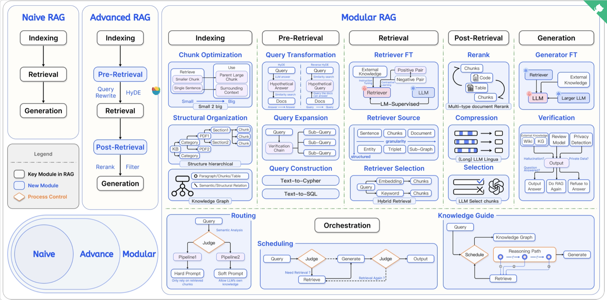

# RAG 简介

## 技术原理

（1）检索阶段：寻找“非参数化知识”

	• 知识向量化：嵌入模型（Embedding Model） 充当了“连接器”的角色。它将外部知识库编码为向量索引（Index），存入向量数据库。
	• 语义召回：当用户发起查询时，检索模块利用同样的嵌入模型将问题向量化，并通过相似度搜索（Similarity Search），从海量数据中精准锁定与问题最相关的文档片段。
（2）生成阶段：融合两种知识

	• 上下文整合：生成模块接收检索阶段送来的相关文档片段以及用户的原始问题。
	• 指令引导生成：该模块会遵循预设的 Prompt 指令，将上下文与问题有效整合，并引导 LLM（如 DeepSeek）进行可控的、有理有据的文本生成。

## 技术演进

这张图是一张非常全面且系统性的**RAG（Retrieval-Augmented Generation，检索增强生成）技术演进与架构全景图**。它详细展示了 RAG 系统从最基础的线性流程发展到高度模块化、动态化的复杂系统。

为了清晰地梳理，我们可以按照图中的三大模块（Naive RAG, Advanced RAG, Modular RAG）以及左下角的演进关系（Venn图）进行详细解析。

---

### 一、 RAG 技术的演进关系 (图左下角)
图中左下角的集合图清晰地展示了 RAG 的发展阶段：**Naive (原生) ⊂ Advance (进阶) ⊂ Modular (模块化)**。
这意味着进阶版包含了原生版的核心要素，而模块化版则集成了前两者的所有能力，并将其解耦为可自由组合的灵活模块。

---

### 二、 Naive RAG (原生 RAG - 左侧图)
这是 RAG 最基础、最经典的线性范式，包含三个核心固定模块（黑色边框线）：
1.  **Indexing (索引)**：将外部文档切块（Chunking）、向量化并存入向量数据库。
2.  **Retrieval (检索)**：根据用户的 Query（查询），在向量数据库中检索出最相似的文档块。
3.  **Generation (生成)**：将检索到的文档块作为上下文，与用户的 Query 一起输入给 LLM（大语言模型），生成最终答案。

---

### 三、 Advanced RAG (进阶 RAG - 中左侧图)
在 Naive RAG 的基础上，为了解决检索质量和生成质量的问题，增加了检索前（Pre-Retrieval）和检索后（Post-Retrieval）的处理模块：
1.  **Pre-Retrieval (检索前)**：主要对用户的 Query 进行优化。
    *   *Query Rewrite (查询重写)*：让语言模型重新表述用户的查询，使其更适合检索。
    *   *HyDE (假设性文档嵌入)*：先让 LLM 生成一个“假设性”的答案，然后用这个假设性答案去检索真实文档，通常能提高语义匹配度。
2.  **Post-Retrieval (检索后)**：对检索回来的内容进行过滤和优化。
    *   *Rerank (重排序)*：使用专门的排序模型，对初步检索出的文档进行二次打分和精确排序。
    *   *Filter (过滤)*：剔除相关性过低或冗余的文档块。

---

### 四、 Modular RAG (模块化 RAG - 右侧及核心主体图)
这是当前 RAG 架构的最前沿形态。它打破了固定的线性流程，将整个 RAG 系统拆解为高度专业化的模块，并引入了**编排（Orchestration）**的概念，使其具备了类似 Agent（智能体）的动态路由和推理能力。

以下是 Modular RAG 各个子模块的详细知识点梳理：

#### 1. Indexing (索引阶段的优化)
*   **Chunk Optimization (切块优化)**：不再是简单的固定长度切块。
    *   *Small 2 big (从小到大/父子块)*：检索时使用“Small Chunk (小块/单句)”以保证检索的精准度，但喂给 LLM 时则提供其所在的“Parent Large Chunk (父级大块)”或“Surrounding Context (上下文)”，以提供完整的语义环境。
*   **Structural Organization (结构化组织)**：建立文档的层级结构。从知识库 (KB) -> 分类 (Category) -> 文件 (PDF) -> 章节 (Section) -> 文档块 (Chunk)，保留文档的原始目录和层级关系。
*   **Knowledge Graph (知识图谱)**：引入图数据库。提取文档中的段落、表格区块，并建立它们之间的“语义/结构关系 (Semantic/Structural Relation)”。

#### 2. Pre-Retrieval (检索前的深度转换)
*   **Query Transformation (查询转换)**：
    *   *HyDE (正向)*：Query -> LLM生成答案 -> 去文档库做相似度检索。
    *   *Reverse HyDE (逆向)*：利用相似度检索反推文档能回答的问题。
*   **Query Expansion (查询扩展)**：
    *   将一个复杂的 Query 拆解为多个 *Sub-Query (子查询)*。
    *   引入 *Verification Chain (验证链)* 来确保扩展查询的合理性。
*   **Query Construction (查询构建)**：将自然语言转换为结构化查询语言。
    *   *Text-to-Cypher*：用于查询图数据库 (Neo4j等)。
    *   *Text-to-SQL*：用于查询关系型数据库 (MySQL等)。

#### 3. Retrieval (检索阶段的增强)
*   **Retriever FT (检索器微调)**：通过外部知识、对比学习（正负样本对）、指令微调或 LLM 监督来训练专属的检索/嵌入模型（Embedding Model）。
*   **Retriever Source (检索源扩展)**：不仅检索文本块。
    *   *Granularity (不同粒度)*：句子级、块级、篇章级。
    *   *Structured (结构化数据)*：检索知识图谱中的实体 (Entity)、三元组 (Triplet)、子图 (Sub-Graph)。
*   **Retriever Selection (检索器选择 / 混合检索)**：
    *   结合 Dense Retrieval (基于Embedding/向量) 和 Sparse Retrieval (基于Keyword/关键词如BM25)，实现 **Hybrid Retrieval (混合检索)**。

#### 4. Post-Retrieval (检索后的深度处理)
*   **Rerank (重排)**：多模态/多类型文档重排。不仅对文本 Chunk，也对代码 (Code)、表格 (Table) 进行综合重排。
*   **Compression (上下文压缩)**：使用类似 *LLMLingua* 的技术，压缩长文本中不重要的词元（Token），提取核心信息，以节省上下文窗口并提高 LLM 注意力集中度。
*   **Selection (智能选择)**：直接使用 LLM 来判断并挑选出对回答问题最有用的文档块。

#### 5. Generation (生成与验证阶段)
*   **Generator FT (生成器微调)**：使用检索到的外部知识，或者用大模型蒸馏出的小模型来进行特定领域的微调。
*   **Verification (输出验证 - 极其关键)**：在输出前增加事实核查与风控环节。
    *   验证源：外部知识维基 (Wiki)、知识图谱 (KG)。
    *   验证项：审查模型 (Review Model) 检查是否发生**幻觉 (Hallucination)**？问题是否得到解答？是否涉及隐私泄露 (Privacy Detection)？
    *   执行动作（菱形判断框）：根据验证结果决定是直接**输出答案 (Output)**、**重新执行 RAG (Do RAG Again)** 还是 **拒绝回答 (Refuse to Answer)**。

#### 6. Orchestration (系统编排 - Modular RAG 的大脑，图下侧)
这是模块化 RAG 的灵魂，它让系统从“流水线”变成了“智能调度中心”。包含判断逻辑（橙色菱形）。
*   **Routing (路由调度)**：根据 Query 的语义分析结果，由 Judge（判别器）决定走哪条 Pipeline。例如：
    *   *Pipeline 1 (Hard Prompt)*：强制约束模型仅依赖检索到的 Chunk 回答。
    *   *Pipeline 2 (Soft Prompt)*：当检索不到时，允许模型利用自身内在知识回答。
*   **Scheduling (动态调度/循环)**：实现类似 Agent 的动态流。
    *   判断 Query 是否需要检索？(Need Retrieval?)
    *   如果生成结果不好，是否需要再次检索？(Retrieval Again?)
*   **Knowledge Guide (知识引导)**：将知识图谱与推理结合。
    *   系统先规划推理路径 (Reasoning Path)，沿着图谱的关系边 (r) 一步步深入，每一步都可能触发一次检索，最后综合所有信息生成最终答案。

### 总结

----

这张图描绘了 RAG 系统从“**傻瓜式检索+生成**”(Naive) 到 “**增加前后处理的流水线**”(Advanced)，再到“**高度定制、动态路由、多路召回、具备自我验证和自我纠错能力的智能体架构**”(Modular) 的完整演进路线。目前的工业级落地（尤其是企业级知识库应用）基本都在朝着 Modular RAG 的方向探索和深耕。

----
**RAG 的核心在于“将 LLM 的内在参数化知识与外部非参数化知识相结合”**

# 准备工作

