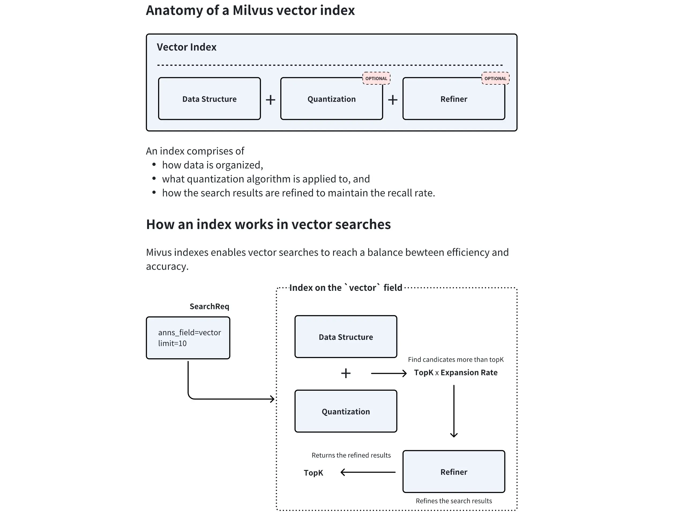

Embedding 的真正意义在于，它产生的向量不是随机数值的堆砌，而是对数据**语义**的数学编码。

- **核心原则**：在 Embedding 构建的向量空间中，语义上相似的对象，其对应的向量在空间中的距离会更近；而语义上不相关的对象，它们的向量距离会更远。
- **关键度量**：我们通常使用以下数学方法来衡量向量间的“距离”或“相似度”：
    - **余弦相似度 (Cosine Similarity)** ：计算两个向量夹角的余弦值。值越接近 1，代表方向越一致，语义越相似。这是最常用的度量方式。
    - **点积 (Dot Product)** ：计算两个向量的乘积和。在向量归一化后，点积等价于余弦相似度。
    - **欧氏距离 (Euclidean Distance)** ：计算两个向量在空间中的直线距离。距离越小，语义越相似。

## 迭代测试与优化

> 不要只依赖公开榜单做最终决定。

- （1）确定基线 (Baseline) ：根据上述维度，选择几个符合要求的模型作为你的初始基准模型。
- （2）构建私有评测集 ：根据真实业务数据，手动创建一批高质量的评测样本，每个样本包含一个典型用户问题和它对应的标准答案（或最相关的文档块）。
- （3）迭代优化 ： - 使用基线模型在你的私有评测集上运行，评估其召回的准确率和相关性。 - 如果效果不理想，可以尝试更换模型，或者调整 RAG 流程的其他环节（如文本分块策略）。 - 通过几轮的对比测试和迭代优化，最终选出在你的特定场景下表现最佳的那个“心仪”模型。

## 向量数据库

向量数据库的核心是高效处理高维向量的相似性搜索。向量是一组有序的数值，可以表示文本、图像、音频等复杂数据的特征或属性。在 RAG 系统中，向量一般通过嵌入模型将原始数据转换为高维向量表示，比如上一节的图文示例。向量数据库通常采用四层架构，通过**存储层、索引层、查询层和服务层**的协同工作来实现高效相似性搜索，其中
- 存储层负责存储向量数据和元数据，优化存储效率并支持分布式存储；
- 索引层维护索引算法（HNSW、LSH、PQ等），负责索引的创建与优化，并支持索引调整；
- 查询层处理查询请求，支持混合查询并实现查询优化；
- 服务层管理客户端连接，提供监控和日志能力，并实现安全管理。

主要技术手段包括：
• 基于树的方法：如 Annoy 使用的随机投影树，通过树形结构实现对数复杂度的搜索
• 基于哈希的方法：如 LSH（局部敏感哈希），通过哈希函数将相似向量映射到同一“桶”
• 基于图的方法：如 HNSW（分层可导航小世界图），通过多层邻近图结构实现快速搜索
• 基于量化的方法：如 Faiss 的 IVF 和 PQ，通过聚类和量化压缩向量

## Milvus

### Colletion
可以用一个图书馆的比喻来理解 Collection：
- **Collection (集合)**: 相当于一个**图书馆**，是所有数据的顶层容器。一个 Collection 可以包含多个 Partition，每个 Partition 可以包含多个 Entity。
- **Partition (分区)**: 相当于图书馆里的**不同区域**（如“小说区”、“科技区”），将数据物理隔离，让检索更高效。
- **Schema (模式)**: 相当于图书馆的**图书卡片规则**，定义了每本书（数据）必须登记哪些信息（字段）。
- **Entity (实体)**: 相当于**一本具体的书**，是数据本身。
- **Alias (别名)**: 相当于一个**动态的推荐书单**（如“本周精选”），它可以指向某个具体Collection，方便应用层调用，实现数据更新时的无缝切换。

Collection 是 Milvus 中最基本的数据组织单位，类似于关系型数据库中的一张**表 (Table)**。是我们存储、管理和查询向量及相关元数据的容器。所有的数据操作，如插入、删除、查询等，都是围绕 Collection 展开的。

### Schema

Schema 通常包含以下几类字段：
- 主键字段 (Primary Key Field): 每个 Collection 必须有且仅有一个主键字段，用于唯一标识每一条数据（实体）。它的值必须是唯一的，通常是整数或字符串类型。
- 向量字段 (Vector Field): 用于存储核心的向量数据。一个 Collection 可以有一个或多个向量字段，以满足多模态等复杂场景的需求。
- 标量字段 (Scalar Field): 用于存储除向量之外的元数据，如字符串、数字、布尔值、JSON 等。这些字段可以用于过滤查询，实现更精确的检索。

### 索引

如何在“搜索速度（效率）”和“搜索准确度（召回率）”之间取得完美平衡。

----

### 第一部分：向量索引的解剖学 (Anatomy of a Milvus vector index)

图的上半部分说明了一个完整的 Milvus 向量索引是由三个基本组件构成的（其中两个是可选的）：

1.  **Data Structure（数据结构）- 必选**：
    *   **含义**：决定了向量数据在内存或磁盘中是如何被组织和划分的。
    *   **作用**：比如常见的 IVF（倒排文件索引）、HNSW（分层导航小世界图）。它就像是图书馆里的书架分类系统，能让你在搜索时不需要全库扫描，而是直接定位到最有可能包含目标向量的“区域”。
2.  **Quantization（量化算法）- 可选 (Optional)**：
    *   **含义**：一种数据压缩技术（如 PQ 乘积量化、SQ 标量量化等）。
    *   **作用**：原始的浮点数向量极其消耗内存。量化通过牺牲一点点精度，将高维度的浮点数压缩成低维或低精度的格式。这不仅**大幅降低了内存占用**，还能**极大地加速距离计算**。
3.  **Refiner（精排器/优化器）- 可选 (Optional)**：
    *   **含义**：用于对初步搜索结果进行二次精确排序的机制。
    *   **作用**：因为前面使用了“量化”技术，数据精度受损，可能会导致找出来的结果有一点偏差（召回率下降）。Refiner 的作用就是在最后阶段，用未经压缩的原始高精度数据重新算一遍距离，从而**弥补量化带来的精度损失**。

---

### 第二部分：索引在向量搜索中是如何工作的 (How an index works in vector searches)

图的下半部分展示了一次真实的查询请求（SearchReq）是如何穿过这些组件的。这是一个典型的 **“粗搜 -> 精排” (Coarse Search -> Refine)** 的两阶段检索过程：

**第一步：发起请求 (SearchReq)**
*   客户端发起请求，比如图中的 `anns_field=vector`（在 vector 字段上搜索），`limit=10`（也就是我们需要找最相似的前 10 个结果，即 **TopK = 10**）。

**第二步：基于量化数据的粗搜 (Data Structure + Quantization)**
*   系统拿着查询向量，进入底层的索引数据结构中，利用**被量化（压缩）过的数据**进行极其快速的距离计算。
*   **关键动作：放大候选集 (Find candidates more than topK)**。
    因为系统知道自己用的是压缩数据，算出来的距离不太准，为了防止真正最相似的向量被漏掉，它不会只找 10 个，而是找 **`TopK × Expansion Rate (扩张率)`** 个。
    *   *例如：扩张率设定为 5，系统就会在这一步快速捞出 10 * 5 = 50 个候选向量。*

**第三步：基于原始数据的精排 (Refiner)**
*   上一步捞出的这 50 个候选向量被送入 **Refiner（精排器）**。
*   Refiner 会去底层拉取这 50 个向量的**原始高精度数据**，与查询向量进行严谨的、无损的精确距离计算（Exact Match）。
*   计算完毕后，重新对这 50 个向量进行排序 (Refines the search results)。

**第四步：返回最终结果**
*   经过 Refiner 精确重排后，系统截取最前面的 10 个向量（TopK），将这个既快速又极其精确的结果返回给用户。

### 总结

图片的核心思想就印在中间的那句话上：
> *"Milvus indexes enables vector searches to reach a balance between efficiency and accuracy."* (Milvus 索引使向量搜索在效率和准确性之间达到平衡)。

*   **用量化 (Quantization) 换取极致的效率和内存节省。**
*   **用放大候选集 + 精排 (Refiner) 挽回丢失的准确度。**
这就是目前大规模向量检索最成熟的工业级架构。

### 主要向量索引类型

- FLAT (精确查找)
	◦ 原理：**暴力搜索**（Brute-force Search）。它会计算查询向量与集合中所有向量之间的实际距离，返回最精确的结果。
	◦ 优点：100% 的召回率，结果最准确。
	◦ 缺点：速度慢，内存占用大，不适合海量数据。
	◦ 适用场景：对精度要求极高，且**数据规模较小**（百万级以内）的场景。
	
- IVF 系列 (倒排文件索引)
	◦ 原理：类似于书籍的目录。它首先通过聚类将所有向量分成多个“桶”(nlist)，查询时，先找到最相似的几个“桶”，然后只在这几个桶内进行精确搜索。IVF_FLAT、IVF_SQ8、IVF_PQ 是其不同变体，主要区别在于是否对桶内向量进行了压缩（量化）。
	◦ 优点：通过缩小搜索范围，极大地提升了检索速度，是性能和效果之间很好的平衡。
	◦ 缺点：召回率不是100%，因为相关向量可能被分到了未被搜索的桶中。
	◦ 适用场景：通用场景，尤其适合需要**高吞吐量**的大规模数据集。
	
- HNSW (基于图的索引)
	◦ 原理：构建一个多层的邻近图。查询时从最上层的稀疏图开始，快速定位到目标区域，然后在下层的密集图中进行精确搜索。
	◦ 优点：检索速度极快，召回率高，尤其擅长处理高维数据和低延迟查询。
	◦ 缺点：内存占用非常大，构建索引的时间也较长。
	◦ 适用场景：对查询延迟有严格要求（如实时推荐、在线搜索）的场景。
	
- DiskANN (基于磁盘的索引)
	◦ 原理：一种为在 SSD 等高速磁盘上运行而优化的图索引。
	◦ 优点：支持远超内存容量的海量数据集（十亿级甚至更多），同时保持较低的查询延迟。
	◦ 缺点：相比纯内存索引，延迟稍高。
	◦ 适用场景：数据规模巨大，无法全部加载到内存的场景。

|场景|推荐索引|备注|
|:--|:--|:--|
|数据可完全载入内存，追求低延迟|**HNSW**|内存占用较大，但查询性能和召回率都很优秀。|
|数据可完全载入内存，追求高吞吐|**IVF_FLAT / IVF_SQ8**|性能和资源消耗的平衡之选。|
|数据量巨大，无法载入内存|**DiskANN**|在 SSD 上性能优异，专为海量数据设计。|
|追求 100% 准确率，数据量不大|**FLAT**|暴力搜索，确保结果最精确。|

### 3.3检索优化

#### 3.3.1 基础向量检索

拥有了数据容器 (Collection) 和检索引擎 (Index) 后，最后一步就是从海量数据中高效地检索信息。这是 Milvus 的核心功能之一，**近似最近邻 (Approximate Nearest Neighbor, ANN) 检索**。与需要计算全部数据的暴力检索（Brute-force Search）不同，ANN 检索利用预先构建好的索引，能够极速地从海量数据中找到与查询向量最相似的 Top-K 个结果。这是一种在速度和精度之间取得极致平衡的策略。

- **主要参数**:
    - `anns_field`: 指定要在哪个向量字段上进行检索。
    - `data`: 传入一个或多个查询向量。
    - `limit` (或 `top_k`): 指定需要返回的最相似结果的数量。
    - `search_params`: 指定检索时使用的参数，例如距离计算方式 (`metric_type`) 和索引相关的查询参数。

#### 3.3.2 增强检索

在基础的 ANN 检索之上，Milvus 提供了多种增强检索功能，以满足更复杂的业务需求。

**过滤检索 (Filtered Search)**

在实际应用中，我们很少只进行单纯的向量检索。更常见的需求是“在满足特定条件的向量中，查找最相似的结果”，这就是过滤检索。它将**向量相似性检索**与**标量字段过滤**结合在一起。

- **工作原理**：先根据提供的过滤表达式 (`filter`) 筛选出符合条件的实体，然后仅在这个子集内执行 ANN 检索。这极大地提高了查询的精准度。
- **应用示例**：
    - **电商**："检索与这件红色连衣裙最相似的商品，但只看价格低于500元且有库存的。"
    - **知识库**："查找与‘人工智能’相关的文档，但只从‘技术’分类下、且发布于2023年之后的文章中寻找。"

**范围检索 (Range Search)**

有时我们关心的不是最相似的 Top-K 个结果，而是“所有与查询向量的相似度在特定范围内的结果”。

- **工作原理**：范围检索允许定义一个距离（或相似度）的阈值范围。Milvus 会返回所有与查询向量的距离落在这个范围内的实体。
- **应用示例**：
    - **人脸识别**："查找所有与目标人脸相似度超过 0.9 的人脸"，用于身份验证。
    - **异常检测**："查找所有与正常样本向量距离过大的数据点"，用于发现异常。

**多向量混合检索 (Hybrid Search)**

这是 Milvus 提供的一种极其强大的高级检索模式，它允许在一个请求中同时检索**多个向量字段**，并将结果智能地融合在一起。

- **工作原理**：
    
    1. **并行检索**：应用针对不同的向量字段（如一个用于文本语义的密集向量，一个用于关键词匹配的稀疏向量，一个用于图像内容的多模态向量）分别发起 ANN 检索请求。
    2. **结果融合 (Rerank)**：Milvus 使用一个重排策略（Reranker）将来自不同检索流的结果合并成一个统一的、更高质量的排序列表。常用的策略有 `RRFRanker`（平衡各方结果）和 `WeightedRanker`（可为特定字段结果加权）。
- **应用示例**：
    
    - **多模态商品检索**：用户输入文本“安静舒适的白色耳机”，系统可以同时检索商品的**文本描述向量**和**图片内容向量**，返回最匹配的商品。
    - **增强型 RAG**: 结合**密集向量**（捕捉语义）和**稀疏向量**（精确匹配关键词），实现比单一向量更精准的文档检索效果。

**分组检索 (Grouping Search)**

分组检索解决了一个常见的痛点：检索结果多样性不足。想象一下，你检索“机器学习”，返回的前10篇文章都来自同一本教科书不同章节。这显然不是理想的结果。

- **工作原理**：分组检索允许指定一个字段（如 `document_id`）对结果进行分组。Milvus 会在检索后，确保返回的结果中每个组（每个 `document_id`）只出现一次（或指定的次数），且返回的是该组内与查询最相似的那个实体。
- **应用示例**：
    - **视频检索**：检索“可爱的猫咪”，确保返回的视频来自不同的博主。
    - **文档检索**：检索“数据库索引”，确保返回的结果来自不同的书籍或来源。

通过这些灵活的检索功能组合，开发者可以构建出满足各种复杂业务需求的向量检索应用。

### 3.4 索引优化

#### 3.4.1 上下文扩展

句子窗口检索的思想可以概括为：**为检索精确性而索引小块，为上下文丰富性而检索大块**。

其工作流程如下：

（1）**索引阶段**：在构建索引时，文档被分割成**单个句子**。每个句子都作为一个独立的“节点（Node）”存入向量数据库。同时，每个句子节点都会在元数据（metadata）中存储其**上下文窗口**，即该句子原文中的前N个和后N个句子。这个窗口内的文本不会被索引，仅仅是作为元数据存储。

（2）**检索阶段**：当用户发起查询时，系统会在所有**单一句子节点**上执行相似度搜索。因为句子是表达完整语义的最小单位，所以这种方式可以非常精确地定位到与用户问题最相关的核心信息。

（3）**后处理阶段**：在检索到最相关的句子节点后，系统会使用一个名为 `MetadataReplacementPostProcessor` 的后处理模块。该模块会读取到检索到的句子节点的元数据，并用元数据中存储的**完整上下文窗口**来替换节点中原来的单一句子内容。

（4）**生成阶段**：最后，这些被替换了内容的、包含丰富上下文的节点被传递给LLM，用于生成最终的答案。

#### 3.4.2 结构化索引

随着知识库的规模不断扩大（例如，包含数百个PDF文件），传统的RAG方法（即对所有文本块进行top-k相似度搜索）会遇到瓶颈。当一个查询可能只与其中一两个文档相关时，在整个文档库中进行无差别的向量搜索，不仅效率低下，还容易被不相关的文本块干扰，导致检索结果不精确。

为了解决这个问题，一个有效的方法是利用**结构化索引**。其原理是在索引文本块的同时，为其附加结构化的**元数据（Metadata）**。这些元数据可以是任何有助于筛选和定位信息的标签，例如：

- 文件名
- 文档创建日期
- 章节标题
- 作者
- 任何自定义的分类标签

实际上，在第二章“文本分块”中介绍的**基于文档结构的分块**方法，就是实现结构化索引的一种前置步骤。例如，在使用 `MarkdownHeaderTextSplitter` 时，分块器会自动将Markdown文档的各级标题（如 `Header 1`, `Header 2` 等）提取并存入每个文本块的元数据中。这些标题信息就是非常有价值的结构化数据，可以直接用于后续的元数据过滤。

通过这种方式，可以在检索时实现“元数据过滤”和“向量搜索”的结合。例如，当用户查询“请总结一下2023年第二季度财报中关于AI的论述”时，系统可以：

（1）**元数据预过滤**：首先通过元数据筛选，只在 `document_type == '财报'`、`year == 2023` 且 `quarter == 'Q2'` 的文档子集中进行搜索。

（2）**向量搜索**：然后，在经过滤的、范围更小的文本块集合中，执行针对查询“关于AI的论述”的向量相似度搜索。

这种“先过滤，再搜索”的策略，能够极大地缩小检索范围，显著提升大规模知识库场景下RAG应用的检索效率和准确性。LlamaIndex 提供了包括“自动检索”（Auto-Retrieval）在内的多种工具来支持这种结构化的检索范式。

## 索引

----

在向量数据库中，索引（Index）是其最核心的组件之一。与传统关系型数据库中的索引（如 B+ 树，用于精确匹配）不同，向量数据库的索引主要用于处理高维数据的**相似性搜索**。

以下是关于向量数据库中索引的作用以及常见索引类型的详细介绍：

### 一、 向量数据库中索引的作用

1. **加速检索（将 KNN 转化为 ANN）**
   * **背景**：如果没有索引，要找到与查询向量最相似的向量，数据库必须进行**暴力搜索（KNN，K-Nearest Neighbors）**，即计算查询向量与数据库中*每一个*向量的距离。当数据量达到百万、千万甚至十亿级别，且维度很高（如 768维、1536维）时，这种计算极其缓慢。
   * **作用**：索引通过特定的数据结构，将全量搜索转化为**近似最近邻搜索（ANN, Approximate Nearest Neighbor）**。它能够快速过滤掉大量绝对不相似的向量，只在极小的范围内进行精确比较，从而将检索时间从几分钟/几秒钟压缩到几毫秒。
2. **优化内存与存储空间（数据压缩）**
   * 高维向量非常占用内存空间。某些索引技术（如量化索引）可以在构建索引时对原始向量进行压缩，大幅降低内存占用，使单台机器能够处理更大规模的数据。
3. **平衡“性能铁三角”（召回率、延迟、内存）**
   * 向量索引允许开发者在这三者之间进行权衡：想要速度快、内存小，可以牺牲一点准确度（召回率）；想要高准确度，就可以选择占用内存大一些的索引结构。

---

### 二、 常见的向量索引类型

不同的索引在底层使用的数据结构和算法不同，目前主流的向量索引主要分为以下几类：

#### 1. 基于图的索引（Graph-based）
这是目前**最主流、性能最好**的向量索引方式，尤其在追求高召回率和低延迟的场景下。
* **HNSW（Hierarchical Navigable Small World / 分层可导航小世界）**
  * **原理**：借鉴了现实世界中的“六度分隔理论”，构建多层级的图结构。顶层图节点很少，连接的是距离较远的向量（用于快速跨越广阔的搜索空间）；底层图节点包含所有向量，连接的是距离较近的向量（用于精准定位）。检索时从顶层向下逐层查找。
  * **优点**：搜索速度极快，召回率极高（通常能达到 95% 以上）。
  * **缺点**：构建索引比较慢，且非常消耗内存（因为要存储大量的图节点关系）。

#### 2. 基于倒排文件的索引（Inverted File / Clustering-based）
利用聚类算法对搜索空间进行划分。
* **IVF（Inverted File Index / 倒排文件索引）**
  * **原理**：使用 K-Means 等聚类算法，将海量向量预先划分为多个簇（Cluster），每个簇有一个中心点（Centroid）。检索时，先计算查询向量与各个中心点的距离，找出最近的几个簇，然后只在这几个簇内部进行搜索。
  * **优点**：大幅缩小了搜索范围，搜索速度快，内存占用适中。
  * **缺点**：如果处于聚类边界上的向量，可能会出现漏检（即降低了召回率）。

#### 3. 基于量化的索引（Quantization-based）
主要用于压缩数据，通常与其他索引（如 IVF）结合使用。
* **PQ（Product Quantization / 乘积量化）**
  * **原理**：将高维向量切分成多个低维的子段，然后对每个子段分别进行聚类求出“密码本”（Codebook），用极短的编码来代替原来的高维浮点数向量。
  * **优点**：极大地压缩了内存占用（可以将内存需求降低几十倍），并且能在压缩状态下直接估算距离。
  * **缺点**：因为是压缩后的近似计算，会损失一定的精度（召回率下降）。
  * **常见组合**：**IVF-PQ**（先分簇，再压缩），这是处理超大规模工业级数据最经典的组合方案。

#### 4. 基于哈希的索引（Hash-based）
* **LSH（Locality-Sensitive Hashing / 局部敏感哈希）**
  * **原理**：设计一种特殊的哈希函数，使得在空间中距离相近的向量，经过哈希计算后有很大概率落入同一个哈希桶（Bucket）中。检索时只需计算查询向量的哈希值，去对应的桶里找。
  * **优点**：构建速度快，插入新数据快。
  * **缺点**：在高维数据下，哈希碰撞难以控制，导致召回率不稳定或不够理想，目前在现代向量数据库中已逐渐被 HNSW 等取代。

#### 5. 基于树的索引（Tree-based）
* **Annoy（Approximate Nearest Neighbors Oh Yeah）**
  * **原理**：Spotify 开发的算法。通过随机选择超平面，不断地将空间一分为二，构建多棵二叉森林（Forest）。检索时顺着树往下找。
  * **优点**：实现简单，支持将索引映射到磁盘（Mmap），内存开销小。
  * **缺点**：维度太高（>100维）时性能下降明显（维度灾难），且只能处理静态数据（新增数据通常需要重建整棵树）。

#### 6. 平坦索引 / 暴力搜索（Flat Index）
* **Flat (Exact Search)**
  * **原理**：不对数据做任何压缩或分层，就是最原始的 KNN 暴力计算。
  * **优点**：召回率 100%（绝对精确），无需构建索引的时间。
  * **缺点**：数据量大时速度极慢。通常只用作基准测试（Benchmark）或数据量非常小（几万条以内）的场景。

---

### 💡 总结：如何选择合适的索引？

在实际应用中（如 Milvus, Pinecone, Qdrant, Weaviate 等数据库中），选择索引通常遵循以下经验法则：

1. **数据量极小**（< 10 万）：直接使用 **Flat**，保证 100% 准确率，速度也能接受。
2. **追求极致的搜索速度和高准确率，且内存预算充足**：首选 **HNSW**（大模型 RAG 场景中最常用的默认索引）。
3. **数据量巨大（几千万到十亿级），内存有限**：选择 **IVF-PQ** 或 **IVF-SQ**，通过牺牲少量准确率换取巨大的内存节省和可接受的速度。
4. **需要控制成本并处理超大规模数据**：可以考虑较新的基于磁盘的索引（如 **DiskANN**），将索引主要存在 SSD 上，大幅降低内存成本。