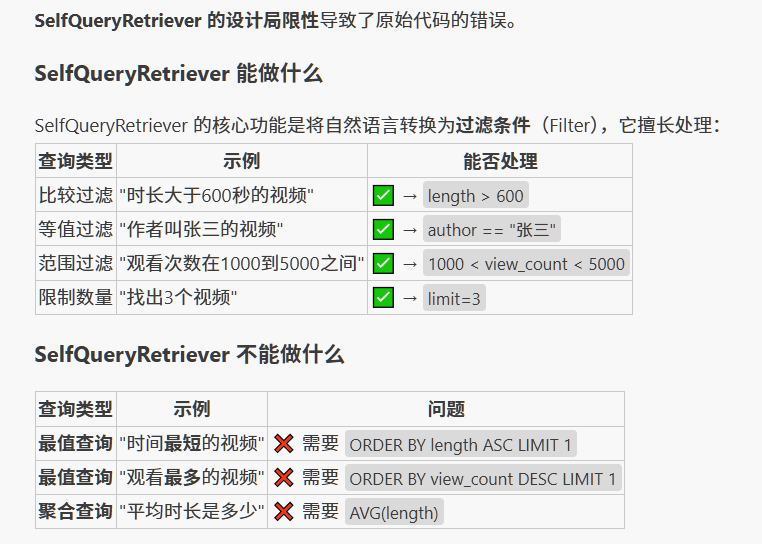

# 混合检索

### 1.1 稀疏向量

稀疏向量，也常被称为“词法向量”，是基于词频统计的传统信息检索方法的数学表示。它通常是一个维度极高（与词汇表大小相当）但绝大多数元素为零的向量。它采用精准的“词袋”匹配模型，将文档视为一堆词的集合，不考虑其顺序和语法，其中向量的每一个维度都直接对应一个具体的词，非零值则代表该词在文档中的重要性（权重）。这类向量的经典权重计算方法是 TF-IDF。在信息检索领域，BM25 则是基于这种稀疏表示的成功且应用广泛的排序算法之一，其核心公式如下：

### 1.2 密集向量

密集向量，也常被称为“语义向量”，是通过深度学习模型学习到的数据（如文本、图像）的低维、稠密的浮点数表示。这些向量旨在将原始数据映射到一个连续的、充满意义的“语义空间”中来捕捉“语义”或“概念”。在理想的语义空间中，向量之间的距离和方向代表了它们所表示概念之间的关系。一个经典的例子是 `vector('国王') - vector('男人') + vector('女人')` 的计算结果在向量空间中非常接近 `vector('女王')`，这表明模型学会了“性别”和“皇室”这两个维度的抽象概念。它的代表包括 Word2Vec、GloVe、以及所有基于 Transformer 的模型（如 BERT、GPT）生成的嵌入（Embeddings）。

其主要优点是能够理解同义词、近义词和上下文关系，泛化能力强，在语义搜索任务中表现卓越。但缺点也同样明显：可解释性差（向量中的每个维度通常没有具体的物理意义），需要大量数据和算力进行模型训练，且对于未登录词（OOV）的处理相对困难。

### [2.1 技术原理与融合方法](https://datawhalechina.github.io/all-in-rag/#/chapter4/11_hybrid_search?id=_21-%e6%8a%80%e6%9c%af%e5%8e%9f%e7%90%86%e4%b8%8e%e8%9e%8d%e5%90%88%e6%96%b9%e6%b3%95)

混合检索通常并行执行两种检索算法，然后将两组异构的结果集融合成一个统一的排序列表。以下是两种主流的融合策略：

#### [2.1.1 倒数排序融合 (Reciprocal Rank Fusion, RRF)](https://datawhalechina.github.io/all-in-rag/#/chapter4/11_hybrid_search?id=_211-%e5%80%92%e6%95%b0%e6%8e%92%e5%ba%8f%e8%9e%8d%e5%90%88-reciprocal-rank-fusion-rrf)

RRF 不关心不同检索系统的原始得分，只关心每个文档在各自结果集中的**排名**。其思想是：一个文档在不同检索系统中的排名越靠前，它的最终得分就越高。

其计分公式为：


其中：

- dd 是待评分的文档。
- kk 是检索系统的数量（这里是2，即稀疏和密集）。
- ranki(d)ranki​(d) 是文档 dd 在第 ii 个检索系统中的排名。
- cc 是一个常数（通常设为60），用于降低排名靠前文档的相对权重，实现更稳健的排名融合。

#### [2.1.2 加权线性组合](https://datawhalechina.github.io/all-in-rag/#/chapter4/11_hybrid_search?id=_212-%e5%8a%a0%e6%9d%83%e7%ba%bf%e6%80%a7%e7%bb%84%e5%90%88)

这种方法需要先将不同检索系统的得分进行归一化（例如，统一到 0-1 区间），然后通过一个权重参数 `α` 来进行线性组合。


通过调整 `α` 的值，可以灵活地控制语义相似性与关键词匹配在最终排序中的贡献比例。例如，在电商搜索中，可以调高关键词的权重；而在智能问答中，则可以侧重于语义。

### [2.2 优势与局限](https://datawhalechina.github.io/all-in-rag/#/chapter4/11_hybrid_search?id=_22-%e4%bc%98%e5%8a%bf%e4%b8%8e%e5%b1%80%e9%99%90)

| 优势                                    | 局限                             |
| :------------------------------------ | :----------------------------- |
| **召回率与准确率高**：能同时捕获关键词和语义，显著优于单一检索。    | **计算资源消耗大**：需要同时维护和查询两套索引。     |
| **灵活性强**：可通过融合策略和权重调整，适应不同业务场景。       | **参数调试复杂**：融合权重等超参数需要反复实验调优。   |
| **容错性好**：关键词检索可部分弥补向量模型对拼写错误或罕见词的敏感性。 | **可解释性仍是挑战**：融合后的结果排序理由难以直观分析。 |

# 查询构建

### 一、文本到元数据过滤器

在构建向量索引时，常常会为文档块（Chunks）附加元数据（Metadata），例如文档来源、发布日期、作者、章节、类别等。这些元数据为我们提供了在语义搜索之外进行精确过滤的可能。

**自查询检索器（Self-Query Retriever）** 是LangChain中实现这一功能的核心组件。它的工作流程如下：

1. **定义元数据结构**：首先，需要向LLM清晰地描述文档内容和每个元数据字段的含义及类型。
2. **查询解析**：当用户输入一个自然语言查询时，自查询检索器会调用LLM，将查询分解为两部分：
    - **查询字符串（Query String）**：用于进行语义搜索的部分。
    - **元数据过滤器（Metadata Filter）**：从查询中提取出的结构化过滤条件。
3. **执行查询**：检索器将解析出的查询字符串和元数据过滤器发送给向量数据库，执行一次同时包含语义搜索和元数据过滤的查询。

例如，对于查询“关于2022年发布的机器学习的论文”，自查询检索器会将其解析为：

- **查询字符串**: "机器学习的论文"
- **元数据过滤器**: `year == 2022`

### 二、文本到Cypher

与“文本到元数据过滤器”类似，“文本到Cypher”技术利用大语言模型（LLM）将用户的自然语言问题直接翻译成一句精准的 Cypher 查询语句。LangChain 提供了相应的工具链（如 `GraphCypherQAChain`），其工作流程通常是：

1. 接收用户的自然语言问题。
2. LLM 根据预先提供的图谱模式（Schema），将问题转换为 Cypher 查询。
3. 在图数据库上执行该查询，获取精确的结构化数据。
4. (可选)将查询结果再次交由 LLM，生成通顺的自然语言答案。

由于生成有效的 Cypher 查询是一项复杂的任务，通常使用性能较强的 LLM 来确保转换的准确性。通过这种方式，用户可以用最自然的方式与高度结构化的图数据进行交互，极大地降低了数据查询的门槛。

#### 为什么本节的代码中查询“时间最短的视频”时，得到的结果是错误的？


# Text2LSQL

### 1.知识库模块

框架支持三种类型的知识：

- **DDL知识**：表的结构定义，包括字段类型、约束等
- **Q-SQL知识**：历史问答对，为新问题提供参考模式
- **描述知识**：表和字段的业务含义，帮助理解数据语义

### 2.SQL生成模块

SQL生成模块负责将自然语言问题转换为SQL查询语句，并具备错误修复能力。

### 3.代理模块

代理模块是整个框架的控制中心，协调知识库检索、SQL生成和执行的完整流程。

1. 从知识库检索相关信息
2. 生成SQL语句
3. 执行SQL（带重试机制）
4. 添加LIMIT限制，防止大量数据返回
5. 结构化结果返回

### 4.1模拟数据

假设数据库中的users表包含以下用户数据：

|ID|姓名|邮箱|年龄|城市|
|---|---|---|---|---|
|1|张三|[zhangsan@email.com](mailto:zhangsan@email.com)|25|北京|
|2|李四|[lisi@email.com](mailto:lisi@email.com)|32|上海|
|3|王五|[wangwu@email.com](mailto:wangwu@email.com)|28|广州|
|4|赵六|[zhaoliu@email.com](mailto:zhaoliu@email.com)|35|深圳|
|5|陈七|[chenqi@email.com](mailto:chenqi@email.com)|29|杭州|

### 4.2 知识库检索

**用户输入**："年龄大于30的用户有哪些"

**检索过程**：

1. BGE-M3模型将查询文本转换为768维向量
2. Milvus在知识库中进行语义相似度搜索
3. 返回最相关的5条知识，按相似度排序

**检索结果**：

**DDL知识** (相似度: 0.85)

- 表名：users
- 结构：包含id、name、email、age、city字段
- 约束：id为主键，email唯一

**Q-SQL示例** (相似度: 0.82)

- 问题："查询年龄超过25岁的用户"
- SQL：`SELECT * FROM users WHERE age > 25`
    
    > 这是检索到的相似示例，最终SQL会基于用户实际问题调整为age > 30
    

**表描述** (相似度: 0.78)

- age字段：用户年龄，整数类型
- name字段：用户姓名，文本类型

### 4.2 SQL生成

**上下文构建**： 系统将检索到的知识整理成结构化的上下文信息：

**表结构信息**

- 表名：users
- DDL定义：完整的CREATE TABLE语句
- 字段约束：主键、唯一性等

**表和字段描述**

- age字段：用户年龄，INTEGER类型
- name字段：用户姓名，TEXT类型

**查询示例**

- 相似问题：查询年龄超过25岁的用户
- 参考SQL：`SELECT * FROM users WHERE age > 25`

**SQL生成过程**：

1. DeepSeek分析用户问题的意图：查询满足年龄条件的用户
2. 识别关键信息：年龄字段（age）、比较操作（大于）、阈值（**30**）
3. 参考示例模式：从`WHERE age > 25`学习到`WHERE age > 数值`的模式
4. 模式应用：将用户的实际数值30替换示例中的25
5. 生成目标SQL：`SELECT * FROM users WHERE age > 30`

### 4.3SQL执行与结果处理

**安全处理**：

- 原始SQL：`SELECT * FROM users WHERE age > 30`
- 自动添加限制：`SELECT * FROM users WHERE age > 30 LIMIT 100`

**数据库执行**： SQLite引擎逐行检查users表中的数据：

|用户|年龄检查|结果|
|---|---|---|
|张三|25 > 30?|❌ 不符合|
|李四|32 > 30?|✅ 符合|
|王五|28 > 30?|❌ 不符合|
|赵六|35 > 30?|✅ 符合|
|陈七|29 > 30?|❌ 不符合|

**结果处理**：

- 筛选出2条符合条件的记录
- 转换为结构化JSON格式
- 包含字段名称和数据类型信息

**最终输出**：

```
{
    "success": true,
    "error": null,
    "sql": "SELECT * FROM users WHERE age > 30 LIMIT 100",
    "results": {
        "columns": ["id", "name", "email", "age", "city"],
        "rows": [
            {"id": 2, "name": "李四", "email": "lisi@email.com", "age": 32, "city": "上海"},
            {"id": 4, "name": "赵六", "email": "zhaoliu@email.com", "age": 35, "city": "深圳"}
        ],
        "count": 2
    },
    "retry_count": 0
}
```

通过这个**语义理解 → 结构化查询 → 数据过滤 → 结果输
出**的完整流程，框架成功将用户的自然语言问题转换为精确的数据库查询结果。

# 查询重构与分发

用户的原始问题往往不是最优的检索输入。它可能过于复杂、包含歧义，或者与文档的实际措辞存在偏差。为了解决这些问题，我们需要在检索之前对用户的查询进行“预处理”，这就是本节要探讨的**查询重构与分发**。

这个阶段主要包含两个关键技术：

1. **查询翻译（Query Translation）**：将用户的原始问题转换成一个或多个更适合检索的形式。
2. **查询路由（Query Routing）**：根据问题的性质，将其智能地分发到最合适的数据源或检索器。

## 查询翻译

#### 1.提示词工程

这是最直接的查询重构方法。通过精心设计的提示词（Prompt），可以引导 LLM 将用户的原始查询改写得更清晰、更具体，或者转换成一种更利于检索的叙述风格。

在查询构建的代码示例中，我们发现 `SelfQueryRetriever` 无法正确处理“时间最短的视频”这类需要排序或进行比较的查询。

为了解决这个问题，可以采用一种更高级的提示工程技巧：**让 LLM 直接构建出查询指令**。

这种方法的思路是，要求 LLM 直接分析用户的意图，并生成一个结构化（例如 JSON 格式）的指令，告诉我们的代码应该如何操作。对于“时间最短的视频”这个问题，我们期望 LLM 能直接告诉我们：“请按‘时长’字段进行升序排序，并返回第一条结果”。

（1）**设计一个新的提示词（Prompt），要求 LLM 输出 JSON 格式的排序指令。**
（2）**在代码中调用 LLM，解析其返回的 JSON 指令，并执行相应的排序操作。**

##### 2.多查询分解

当用户提出一个复杂的问题时，直接用整个问题去检索可能效果不佳，因为它可能包含多个子主题或意图。分解技术的核心思想是将这个复杂问题拆分成多个更简单、更具体的子问题。然后，系统分别对每个子问题进行检索，最后将所有检索到的结果合并、去重，形成一个更全面的上下文，再交给 LLM 生成最终答案。

**示例**：

- **原始问题**：“在《流浪地球》中，刘慈欣对人工智能和未来社会结构有何看法？”
- **分解后的子问题**：
    - “《流浪地球》中描述的人工智能技术有哪些？”
    - “《流浪地球》中描绘的未来社会是怎样的？”
    - “刘慈欣关于人工智能的观点是什么？”

LangChain 提供了 `MultiQueryRetriever` 来完成这一过程。LLM 将原始问题从不同角度分解成多个子问题，然后并行为每个子问题检索相关文档。最后，它将所有检索到的文档合并并去重，形成一个更全面的上下文，再传递给语言模型生成最终答案。通过这种策略，极大地丰富了检索结果，在有些应用中可以有效提升后续生成环节的质量。

#### 3.退步提示

退步提示是由 Google DeepMind 团队提出的一种旨在提升大语言模型推理能力的提示工程技巧[2](https://datawhalechina.github.io/all-in-rag/#fn-2)。当面对一个细节繁多或过于具体的问题时，模型直接作答（即便是使用思维链）也容易出错。退步提示通过引导模型“退后一步”来解决这个问题。

其核心流程分为两步：

（1）**抽象化**：首先，引导 LLM 从用户的原始具体问题中，生成一个更高层次、更概括的“退步问题”（Step-back Question）。这个退步问题旨在探寻原始问题背后的通用原理或核心概念。

（2）**推理**：接着，系统会先获取“退步问题”的答案（例如，一个物理定律、一段历史背景等），然后将这个通用原理作为上下文，再结合原始的具体问题，进行推理并生成最终答案。

**示例**：

- **原始问题**：“如果理想气体的温度增加2倍，体积增加8倍，其压力会如何变化？”
- **退步问题**：“这个问题背后的物理原理是什么？”
- **推理过程**：首先回答退步问题，得到“理想气体定律 PV=nRT”。然后基于这个定律，代入具体数值进行计算，最终得出压力变为原来的1/4。

通过先检索或生成高层知识，再进行具体推理，退步提示能够帮助模型构建一个更坚实的逻辑基础，从而提高在复杂问答场景下的准确性。

#### 4.假设性文档嵌入

假设性文档嵌入（Hypothetical Document Embeddings, HyDE）是一种无需微调即可显著提升向量检索质量的查询改写技术。其核心是解决一个普遍存在于检索任务中的难题：用户的查询（Query）通常简短、关键词有限，而数据库中存储的文档则内容详实、上下文丰富，两者在语义向量空间中可能存在“鸿沟”，导致直接用查询向量进行搜索效果不佳。

HyDE 通过一种巧妙的方式来“绕过”这个问题：它不直接使用用户的原始查询，而是先利用一个生成式大语言模型（LLM）来生成一个“假设性”的、能够完美回答该查询的文档。然后，HyDE 将这个内容详实的假设性文档进行向量化，用其生成的向量去数据库中寻找与之最相似的真实文档。HyDE 的工作流程可以分为三个步骤：

（1）**生成**：当接收到用户查询时，首先调用一个生成式 LLM（例如，GPT-3.5）。提示该模型根据查询生成一个详细的、可能是理想答案的文档。这个文档不必完全符合事实，但它必须在语义上与一个好的答案高度相关。

（2）**编码**：将上一步生成的假设性文档输入到一个对比编码器（如 Contriever）中，将其转换为一个高维向量嵌入。这个向量在语义上代表了一个“理想答案”的位置。

（3）**检索**：使用这个假设性文档的向量，在向量数据库中执行相似性搜索，找出与这个“理想答案”最接近的真实文档。这些被检索出的文档将作为最终的上下文信息。

通过这种方式，HyDE 将困难的“查询到文档”的匹配问题，转化为了一个相对容易的“文档到文档”的匹配问题，从而提升检索的准确率。


## 查询路由

查询路由（Query Routing） 是用于优化复杂 RAG 系统的一项关键技术。当系统接入了多个不同的数据源或具备多种处理能力时，就需要一个“智能调度中心”来分析用户的查询，并动态选择最合适的处理路径。其本质是替代硬编码规则，通过语义理解将查询分发至最匹配的数据源、处理组件或提示模板，从而提升系统的效率与答案的准确性。

### 2.1 应用场景

查询路由的应用场景十分广泛。

1. **数据源路由**：这是最常见的场景。根据查询意图，将其路由到不同的知识库。例如：
    
    - 查询“最新的 iPhone 有什么功能？” -> 路由到**产品文档向量数据库**。
    - 查询“我上次订购了什么？” -> 路由到**用户历史SQL数据库**（执行Text-to-SQL）。
    - 查询“A公司和B公司的投资关系是怎样的？” -> 路由到**企业知识图谱数据库**。
2. **组件路由**：根据问题的复杂性，将其分配给不同的处理组件，以平衡成本和效果。
    
    - 简单FAQ → 直接进行向量检索，速度快、成本低。
    - 复杂操作或需要与外部API交互 → 调用 Agent 来执行任务。
3. **提示模板路由**：为不同类型的任务动态选择最优的提示词模板，以优化生成效果。
    
    - 数学问题 → 选用包含分步思考（Step-by-Step）逻辑的提示模板。
    - 代码生成 → 选用专门为代码优化过的提示模板。

### 2.2 实现方法
实现查询路由主要有两种主流方法：

#### 2.2.1 基于LLM的意图识别

- **实现流程**：
    1. 定义清晰的路由选项（例如，数据源名称、功能分类）。
    2. LLM 分析查询并输出决策标签。
    3. 代码根据标签调用相应的检索器或工具。

#### 2.2.2 嵌入相似性路由

这种方法不依赖 LLM 进行分类，延迟更低。它通过计算用户查询与预设的“路由示例语句”之间的向量嵌入相似度来做出决策。

### 2.3 LlamaIndex 拓展

与 LangChain 类似，LlamaIndex 也提供了强大的查询路由功能，LangChain 有异曲同工之处：

- **基于LLM的意图识别**：这是 LlamaIndex 的主要实现方式。通过 `RouterQueryEngine` 来管理一组 `QueryEngineTool`。每个 `Tool` 都包含一个查询引擎和一段描述其功能的文本。路由器会利用一个 `Selector`（如 `LLMSingleSelector` 或更稳定的 `PydanticSingleSelector`）来让 LLM 根据工具的描述文本和用户问题进行语义匹配，从而选择一个或多个最合适的工具来执行。
    
- **嵌入相似性路由**：LlamaIndex 没有提供直接基于向量相似度计算的独立路由组件。它的“语义路由”是融合在基于 LLM 的意图识别中的——即让 LLM 理解每个 `Tool` 描述的 _语义_，并据此做出决策。这种方式更灵活，能够处理更复杂的路由逻辑，而不仅仅是文本相似度匹配。