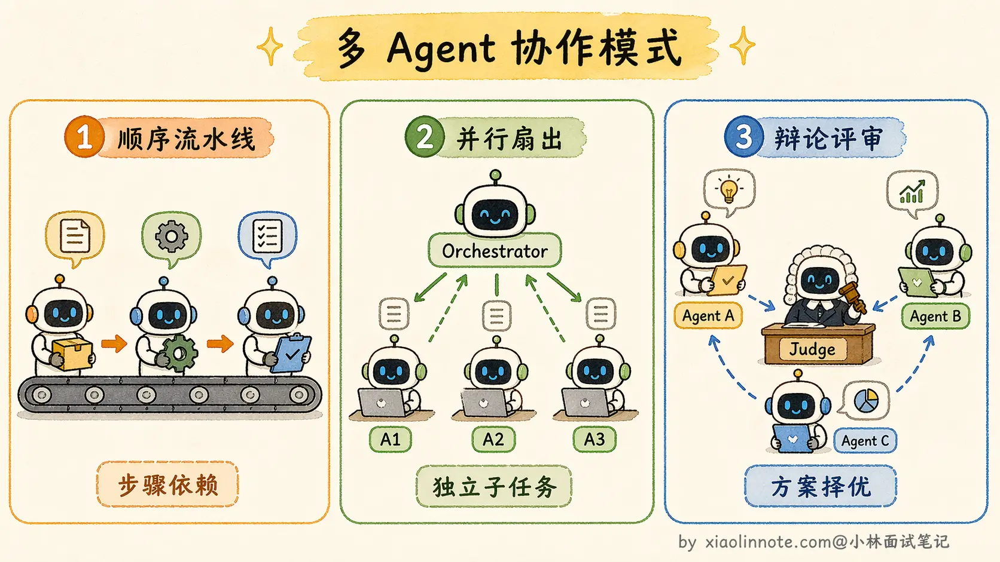
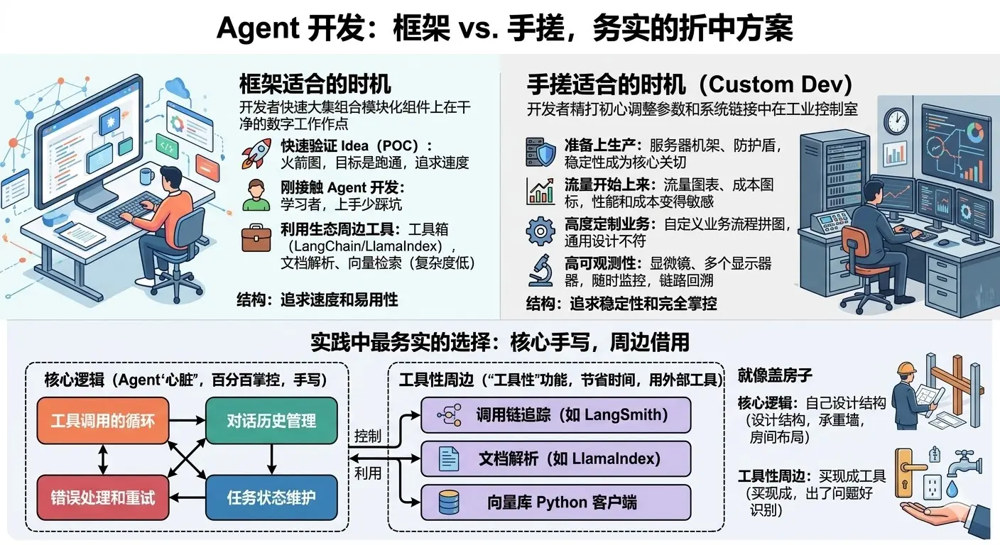

1.Agentic Workflow（Agent作为Workflow中的一个节点）

2.ReAct、Plan and Execute(Replan)、Relection(Relextion)

3.复杂任务拆分（人工拆分与LLM拆分），自适应拆分

4.记忆
- 感知记忆
- 短期记忆
- 长期记忆（情节记忆（具体事件的经历），实义记忆（事实性知识），程序记忆（skills））
- 实体记忆

5.短期记忆进阶：==**结构化工作记忆**==（Structured Working Memory），即给context分区
一个区域专门放「当前任务目标」，一个区域放「已确认的中间结论」，一个区域放「待验证的假设」。每一步执行完之后，Agent 不只是把新消息追加到列表末尾，而是主动更新对应区域的内容，把过时的中间结论替换掉，把已验证的假设移到确认区

6.长期记忆：==**记忆衰减**==，给每条记忆加一个「新鲜度权重」，检索排序时同时考虑语义相似度和时间新鲜度，越久远的记忆权重越低。存储的颗粒度是是「一次完整交互」或「一个独立知识点」

7.Muti-Agent:团队作战代替单打独斗
单Agent的限制：
- context 窗口大小，复杂任务信息量一多就撑爆了
- LLM基于Tranform架构，注意力机制，事情一多，注意力就会被稀释，每件事情做得不够专注，互相干扰
- 任务只能串行处理，效率不高

8.Multi-Agent 之间的协作方式主要有三种模式。第一种是**顺序流水线**（Sequential Pipeline），Agent A 做完把结果交给 Agent B，B 做完交给 Agent C，就像工厂流水线一样，每个环节依次处理。第二种是**并行扇出**（Fan-out），一个调度者把多个独立子任务同时分发给不同的 Worker Agent，它们各自并行执行，最后由调度者收集汇总。第三种是**辩论/评审模式**（Debate/Review），多个 Agent 对同一个问题各自给出方案，然后由一个裁判 Agent 或者它们互相评审来筛选最优解，这种模式在需要高质量决策的场景特别有用，比如代码评审、方案选型。

- CrewAI
- LangGraph：作为 LangChain 生态的扩展，LangGraph 另辟蹊径，将智能体的执行流程建模为**图 (Graph)**。在传统的链式结构中，信息只能单向流动。而 LangGraph 将每一步操作（如调用LLM、执行工具）定义为图中的一个**节点 (Node)**，并用**边 (Edge)** 来定义节点之间的跳转逻辑。这种设计天然支持**循环 (Cycles)**，使得实现如 Reflection 这样的迭代、修正、自我反思的复杂工作流变得异常简单和直观。

9.Multi-Agent 系统的组织方式主要有两种：一种是**中心化**，由一个统一的调度者来分配任务、收集结果；另一种是**去中心化**，Agent 之间自行协商、直接通信。两种方案各有取舍，工程上用得更多的是中心化方案，因为调度逻辑清晰、责任归属明确、排查问题也容易。

10.中心化方案：Orchestrator 其实有几种变体，适合不同复杂度的场景。最基础的是**静态路由**（Static Router），任务拆分和分配规则是预先定义好的，比如「遇到代码任务交给 Coder Agent，遇到搜索任务交给 Researcher Agent」，逻辑简单可预测。进阶一点的是**动态规划**（Dynamic Planner），Orchestrator 本身是一个 LLM，它会根据用户输入动态生成任务计划，决定需要几个步骤、每步交给谁，计划本身也可以在执行过程中调整。最复杂的是**自适应编排**（Adaptive Orchestration），Orchestrator 不仅动态规划，还会根据 Worker 的执行结果实时调整后续计划，比如 Researcher 搜回来的信息不够，Orchestrator 会追加一轮搜索任务，而不是硬着头皮往下走。实际项目里，大多数场景用动态规划就够了，自适应编排虽然更强大但调试复杂度也高很多。

11.去中心化系统里这几类问题会频繁出现：任务分配没有协调、执行顺序没有保证、失败没有感知、没有人来确认「任务整体完成了」。生产环境里，**几乎所有正经项目都选 Orchestrator 模式**，因为可控、可追踪、出了问题能排查，这才是工程上真正需要的。

12.==**渐进式演进**==：先用 Single-Agent 把系统跑起来，当你发现某个环节确实成为瓶颈了，比如 context 经常撑满、某类子任务质量不行，再把那个环节拆出来交给一个专门的 Worker Agent。不要一上来就设计一个五六个 Agent 的复杂系统，你可能连哪里是真正的瓶颈都还没搞清楚。从 Single-Agent 演进到 Multi-Agent 是一个自然的过程，而不是一开始就做的架构决策。

Anthropic写过一篇论文，LLM -> Workflow -> Agent -> Muli-Agent，按照需要菜增加复杂度

13.记忆压缩常见有四种方法：**摘要压缩、滑动窗口、重要性过滤、结构化抽取**。
- 摘要压缩是把长对话总结成简短摘要；
- 滑动窗口是只保留最近 N 轮对话；
- 重要性过滤是打分筛选，只留重要内容；
- 结构化抽取是把关键信息抽成结构化数据存起来。

14.重要性过滤打分的方式有两种。一种是**规则打分**：包含「决定」「确认」「需求」等关键词的记录加分，被后续对话引用次数多的加分，纯闲聊降分。规则快、没有额外开销，但比较粗糙，边界情况容易判断失误。
另一种是让 **LLM 来打分**：逐条判断每条记录的重要程度。准确率更高，但每条记录都需要一次 LLM 调用，开销大，通常在批量清理历史时做，而不是实时处理每条消息。
还有一种更激进的重要性过滤思路叫**观察遮蔽**（Observation Masking）。它的做法不是删除低分内容，而是在构造 prompt 时选择性地「隐藏」某些历史条目。

**主动压缩**（Proactive Compression）。前面说的所有方法都是被动触发的，等 context 快满了才开始压缩。主动压缩的思路是，Agent 在每一步执行完之后，主动判断哪些中间过程可以压缩。主动压缩特别适合工具调用频繁的 Agent，因为工具返回的原始数据往往很长，但真正有用的信息只占一小部分。

15.结构化抽取信息损失最小，只要字段定义合理，重要信息全部被精确保留，没有摘要带来的模糊化。代价是开发成本最高：你需要预先定义「什么是重要字段」，这需要对业务场景有深入理解，而且不同类型的任务所需的字段可能完全不同，通用性较低。

16.还可以用到KV cache。如果 prompt 的前缀部分在多次请求之间是一样的，就把这部分的计算结果缓存起来，下次请求如果前缀匹配，直接复用缓存，不重新计算。费用和延迟都大幅降低，某些场景下能降到原来的十分之一。
记忆压缩在「信息层」工作，决定哪些内容值得被保留在对话历史里；Prompt Caching 在「计算层」工作，对已经决定要带进去的内容减少重复计算的开销。两者解决的不是同一个问题，可以同时使用，是互补关系，不是替代。

17.对话不长、业务简单的场景，滑动窗口就足够了，实现成本最低；对话会很长但不想硬截断的场景，摘要加滑动窗口的组合是最稳健的工程选择；如果业务里有明确定义的「关键信息」（用户偏好、确认事项、状态字段），结构化抽取的信息密度最高，效果也最好；高频调用、长 prompt、成本敏感的系统，Prompt Caching 的收益非常可观，值得优先考虑

18.框架的痛点：
第一是抽象层太多，调试的时候不知道哪步出了问题，得一层层往下扒；
第二是版本升级经常有破坏性变更，线上稳定性难保证；
第三是框架的通用设计往往和具体业务需求有偏差，比如序列化中间结果、触发一堆 callback、记录详细日志......每次调用都在跑。高流量下这些隐性开销累积起来，变成真实可见的延迟增加和费用浪费。

Anthropic 在官方的 Agent 构建指南里也明确提了类似的建议：不要一上来就用框架，先用最少的抽象把核心逻辑跑通。他们的原话大意是「框架的抽象层会让你离底层更远，一旦出了问题，调试成本比你省下的开发时间还高。

19.折中方案：**核心手写，周边借用**
实践中最常见也最务实的选择，是介于两者之间的折中：核心逻辑手写，周边工具性功能借用框架。

控制边界的逻辑是这样的：工具调用的循环、对话历史的管理、错误处理和重试、任务状态的维护，这些是 Agent 的「心脏」，直接决定系统行为，必须百分百理解、百分百掌控，所以手写。而 LangSmith 的 tracing（调用链追踪）、LlamaIndex 的文档解析、某个向量库的 Python 客户端，这些是「工具性」的周边功能，出了问题一眼就能看出来，不会带来黑盒困境，用外部工具节省时间完全值得。

如果你能清楚说出「框架在某个地方替我做了什么、我用的这个方法内部发生了什么」，说明你理解它，用起来有掌控感；如果你只是调了一个方法但完全不知道里面发生了什么，出了问题就是一个不透明的黑盒，这才是需要警惕的信号。框架本身不是问题，「不理解就依赖」才是。

20.给 LLM 加规划能力主要靠这几种思路。
- CoT 是让 LLM 把推理步骤写出来，线性地一步步推导到答案；
- ToT 是让它同时探索多条推理路径，边探索边剪枝，选最优的继续深入；
- GoT 是图结构推理，推理节点可以复用和合并，适合更复杂的任务。
工程上我用 CoT 最多，因为实现成本最低，就是改个 prompt；ToT 效果更好但调用次数多，典型设置（每层 3 条路径、搜 2-3 层）下成本通常是 CoT 的 3-5 倍，极端场景（深搜、更多路径、每步都打分）可能到 10 倍以上。；GoT 目前还比较学术，生产环境我没见过有人真正落地用的。

CoT 解决了「要不要把推理显式化」的问题，答案是要，把过程写出来就能显著减少跳步出错。ToT 解决了「走错方向怎么办」的问题，答案是先多探索几条路，边走边评估边剪枝。GoT 解决了「不同推理路径的中间结论能不能复用」的问题，答案是把结构从树换成图，自然支持结论汇聚与复用。每一步都是在前一步的基础上发现局限、针对性改进。

工程上 Plan-and-Execute 的好处很明显：规划和执行分离之后，规划阶段可以用更强的模型（比如 GPT-4）来保证方向正确，执行阶段可以用更快更便宜的模型来提高效率，成本和质量都能分别优化。

21.给 LLM 加反思能力：多Agent互评，执行 Agent 生成输出，Critic Agent 审查并给出具体批注，执行 Agent 根据批注修改，Critic Agent 再次确认。

22.进阶：
第一个是 **Reflexion**（Shinn 等人 2023 年提出，和 Self-Refine 是同年的工作），这篇论文的核心思路是：不仅让 Agent 反思当前输出的质量，还要让它把「失败经验」存下来，下次遇到类似任务时直接参考，避免重蹈覆辙。这里的"类似"通常通过把经验记忆塞到当前任务的上下文里，让 LLM 自己在生成时参考（而不是靠严格的相似度匹配去检索）。

第二个是 **LATS**（Language Agent Tree Search，Zhou 等人 2024 年提出），它把反思和树搜索结合了起来。前面讲规划能力时提到过 ToT（思维树），LATS 的思路是把**蒙特卡洛树搜索**（MCTS）和反思结合起来：通过 MCTS 同时探索多条路径，每条路径执行之后都会做评估和反思，反思结果作为经验反馈给后续的路径探索。这样一来，Agent 不仅能同时探索多条路径，还能从已经走过的路径里学到教训，让后续的探索更有针对性。代价当然也更大，既有多路径的成本又有反思的成本，目前主要还是学术研究场景，还没看到成熟的生产级实现。

还有一种思路叫**辩论式反思**，不是让一个 Agent 自己审查自己，而是让多个 Agent 互相辩论。比如设置一个「正方 Agent」和一个「反方 Agent」，正方提出一个方案，反方专门挑毛病、提反对意见，正方再针对反对意见优化方案。这种对抗式的反思比单方面审查更能暴露深层问题，因为反方的「职责」就是找漏洞，它会比一个只是「检查一下有没有问题」的 Critic Agent 更积极地挖掘问题。工程上偶尔会在高质量要求的场景里用到这个模式，比如重要的商业决策分析、法律文本审查等。

23.实践中最稳健的做法是两种路由组合用：主流程用静态路由，把确定性的节点切换都写成规则，保证绝大多数情况下系统行为稳定可预测；只在遇到没有匹配规则的边缘情况时，才交给 LLM 动态决策。这样静态路由负责「保底」，动态路由负责「兜住异常」，两者互补。

至于 Handoff 模式，它适合那种每个 Agent 职责边界非常清晰、任务流向相对确定的场景。如果你的系统里 Agent 数量不多、每个 Agent 的输入输出接口定义得很明确，用 Handoff 比用中央 Orchestrator 更简洁。但如果 Agent 数量多、任务流向复杂，还是建议用 Orchestrator 来统一调度，避免 Agent 之间的交接变成一团乱麻。

通信方式的选择同理：如果你的多 Agent 流程是一条相对清晰的流水线，各步骤之间有明确的前后依赖，就用共享状态，简单直接；如果你的系统需要让多个 Agent 独立并行、互相不感知对方的存在，就用消息传递，解耦清晰。