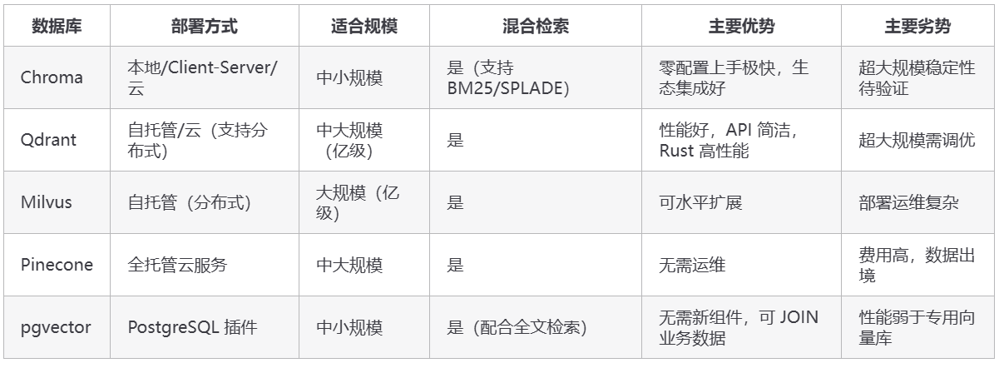
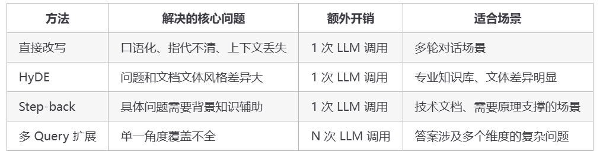

1.相似度检索是解决召回率的问题，rerank是解决召回准确率的问题
1. **召回率（Recall）**： - 定义：在所有相关文档中，系统成功检索出的比例。 - 公式：Recall = (检索出的相关文档数) / (总相关文档数) - 目标：尽量不遗漏任何相关文档（即减少漏检）。
2. **准确度（Precision）**： - 这里我们特指召回的准确度，即检索结果中相关文档的比例。通常我们关注Top K的准确度（Precision@K）。 - 公式：Precision@K = (前K个结果中相关文档数) / K - 目标：确保返回的文档尽可能都是相关的（即减少噪声）。

区别：
- 召回率关注的是系统找到所有相关文档的能力，强调“全”。
- 准确度关注的是系统返回的文档中有多少是相关的，强调“准”。 

联系：两者通常是一对矛盾（召回率高时，准确度往往低；反之亦然）。因为为了追求高召回率，我们可能会放宽检索条件，导致返回更多不相关文档（准确度下降）。而为了追求高准确度，我们可能会设置严格的检索条件，导致漏掉一些相关文档（召回率下降）。

2.

3.我们生产环境用的是 Milvus，数据量级在百万条向量左右，150 万条 1024 维向量，HNSW 索引，P50 延迟 20ms，P99 延迟 60ms，100 QPS 并发稳定。选 Milvus 主要是因为它支持分布式部署和读写分离，适合数据量大、并发高的场景。
我遇到过两个比较典型的瓶颈。

- 第一个是内存压力，百万级的 1024 维向量光原始数据就要好几个 GB，后来我们开启了标量量化 SQ8，把 float32 压成 int8，内存直接降到原来的四分之一。
- 第二个是大批量写入的时候会触发后台 Segment 合并，影响查询延迟，我们的解法是把批量写入改到业务低峰期，分批小批次写入。

3.数据规模和实测性能
搞懂了概念，现在来看实际的数据。我们知识库大概有 **150 万条 chunk**，每条用 BGE-large-zh 模型生成 1024 维的向量，索引用 HNSW（M=16，ef_construction=128）。
先算一下原始数据的内存占用：150 万 × 1024 维 × 4 字节（float32）≈ **6GB**，这是纯向量部分。实际 Milvus 进程完整跑起来大概要 10～12GB 内存，多出来的 4～6GB 不是"索引翻倍"的神秘开销，而是 HNSW 图结构本身、metadata、Collection 管理开销、操作系统缓存这些合起来的占用。你可能会想，12GB 内存而已，现在随便一台服务器都有 32GB，有什么好担心的？但别忘了这只是向量数据本身，同一台机器上还跑着应用服务、Redis、日志收集等各种组件，内存是要抢着用的。
开启 **标量量化**（SQ8） 之后，把每个 float32 压缩成 int8（用 1 字节代替 4 字节）。直觉上理解：就像把精确到小数点后 7 位的数字保留到小数点后 2 位，大部分语义信息其实在高位，截掉低位精度损失极小，但数据量直接缩到 1/4。内存从 10GB 降到约 3GB，召回率基本无损（通常只下降 1 个百分点以内），是最划算的一个优化，几乎没有代价。

实测查询性能（单机 16 核 32G、本地千兆网、HNSW 在内存、ef=100）：单次 top-5 查询 P50 延迟约 20ms，P99 约 60ms，并发 100 QPS 时延迟基本稳定。

4.性能瓶颈
- 瓶颈一：内存不足，查询延迟飙升
最开始没有开量化，机器只有 8GB 内存，Milvus 把向量索引加载进内存之后，留给操作系统的空间已经很小了，稍微有点内存压力就开始频繁 swap（把内存数据换到磁盘），查询延迟直接从 20ms 飙到 2s+。
解法就是上面提到的 SQ8 量化，内存从 10GB 降到 3GB 左右，彻底解决了 swap 问题。还有一个辅助手段：Milvus 支持把原始向量存在磁盘上（mmap），只把索引放内存，进一步节省内存。原始向量只在需要精排时才读，对查询延迟影响不大。

- 瓶颈二：批量写入触发 Segment 合并，查询抖动
内存问题解决了，又来了新问题。每天知识库有增量更新，一次性写入几十万条新数据时，Milvus 后台会触发 Segment 合并操作，把多个小的增量 Segment 合并成大的封存 Segment 并建好索引。还记得前面说的 Segment 合并机制吗？这个过程很耗 CPU 和磁盘 IO，期间查询的 P99 延迟会有明显抖动，从正常的 60ms 涨到 300ms+。

解法有两个思路。一是时间上错峰，把批量写入改到业务低峰期（比如凌晨），避开查询高峰，让 Segment 合并在用户不活跃时静默完成。二是量上化整为零，把每批写入量控制在 500～1000 条以内，分成多批写，每批之间间隔几秒。这样 Segment 合并的冲击变成多次小冲击，而不是一次大冲击，每次合并规模小、耗时短，查询服务基本感知不到抖动。

5.润色Query
**口语化表达用直接改写，文体差异用 HyDE，问题太具体用 Step-back，角度单一用多 Query 扩展。**
